# 前言
--------
这里以百度百科为例子，介绍管理后台的使用，及ngx-pms Agent配置说明

# 目录
* [添加应用](#添加应用)
* [添加普通用户](#添加普通用户)
* [基本权限管理](#基本权限管理)
* [百科代理设置](#百科代理设置)
* [测试用户](#测试用户)

##### 添加应用
---------------
* 首先以root登录管理后台,然后点击右侧的<应用管理>，界面如下：<br/>
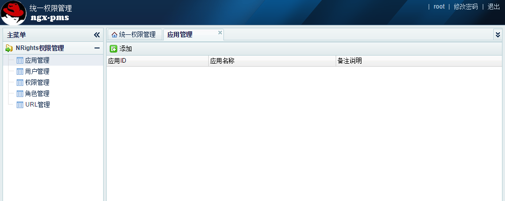
* 然后点击<添加>，弹出应用添加的界面，输入相关信息后：<br/>
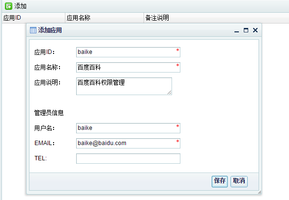
* 点击<保存>，保存成功后，会弹出如下提示框：<br/>
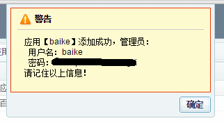<br/>
*请记住应用管理员帐号及密码。*

##### 添加普通用户
-----------------
* 在用户管理中，点击<添加>，在对话框中输入相应的用户名及邮箱：<br/>
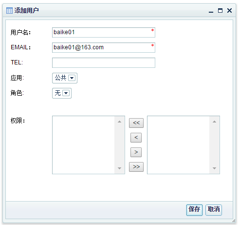<br/>
点击<保存>后，用户就添加成功了。请注意保存好提示框里面的密码。

##### 基本权限管理
-----------------------
应用添加成功后，需要以应用管理员身份登录管理后台，进行相关的管理。*root帐号只能添加应用及用户，不能进行权限及URL管理。*

* 以百科的帐号`baike`登录管理系统：<br/>
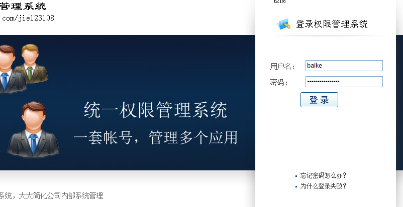<br/>
* 登录后，点击右上角的<修改密码>，来修改baike的密码：
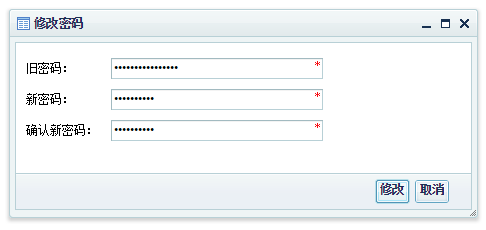<br/>
* 在URL管理中，可以点击<添加>来添加一个新的URL。<br/>

先添加一个URL为`/`,匹配类型为`前缀匹配`，访问权限为`所有人不可访问`的URL。由于URL都以/开头，所以这个URL能匹配所有`未匹配上其它URL的URL`。这个URL设置的意思是所有未配置的URL对所有人都不可访问<br/>
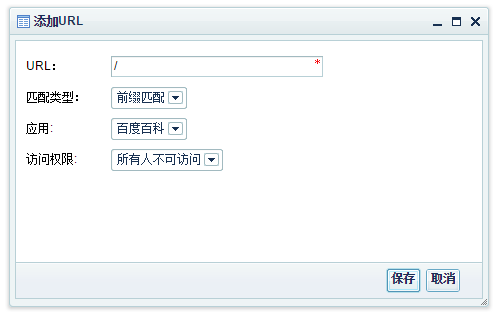<br/>

再添加一个URL为`/`,匹配类型为`精确匹配`，访问权限为`所有人可访问`的URL。这个URL的意思是所有登录用户都可访问百科的首页。<br/>
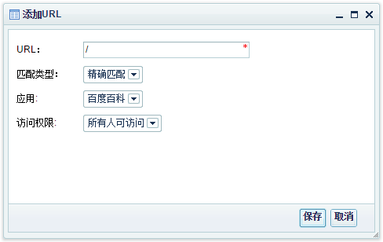<br/>

下面一节介绍在反向代理中设置pms的Agent。

##### 百科代理设置
pms agent需要设置在反向代理上，agent的设置如下。

* 反向代理及pms Agent配置如下：

```nginx
lua_package_path "/data/ngx-pms/?.lua;;";
server {
    listen       88 default; 

    # 代理到ngx-pms服务上。
    location /nright {
        proxy_set_header Host $host;
        proxy_set_header X-Real-IP $remote_addr;
        proxy_set_header REMOTE-HOST $remote_addr;
        proxy_set_header X-Forwarded-For $proxy_add_x_forwarded_for;
        proxy_set_header Accept-Encoding "";
        client_max_body_size 50m;
        client_body_buffer_size 256k;
        # 指向到刚部署的PMS授权服务上。
        proxy_pass    http://127.0.0.1:8000;
    }

    # 清除响应体大小。
    header_filter_by_lua ' ngx.header.content_length = nil '; 
    # 过滤器，在相应页面，加上信息条。
    body_filter_by_lua_file /data/ngx-pms/agent/body_filter.lua;
    # 应用的反向代理设置。
    location / {
        # $app变量的值，必须是已经在管理后台上已经添加成功的应用ID.
        set $app baike;
        # 权限检查的脚本。
        access_by_lua_file /data/ngx-pms/agent/right_check.lua;

        proxy_set_header Host "baike.baidu.com";
        proxy_set_header X-Real-IP $remote_addr;
        proxy_set_header REMOTE-HOST $remote_addr;
        proxy_set_header X-Forwarded-For $proxy_add_x_forwarded_for;
        proxy_set_header Accept-Encoding "";
        # baike的实际地址。
        proxy_pass   http://119.75.222.21;
    }
}
```
配置好之后，就可以启动反向代理了。然后就可以通过反向代理访问百科了。

* 在客户机上，将baike.baidu.com 解析到反向代理上（通过hosts）。然后访问`http://baike.baidu.com`，由于没有登录，统一权限管理系统会跳转到登录页面：
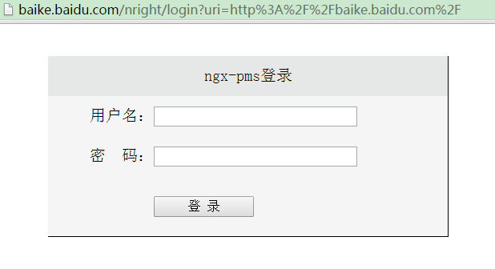<br/>
* 输入帐号及密码后，就进入到了百度百科首页面了：<br/>
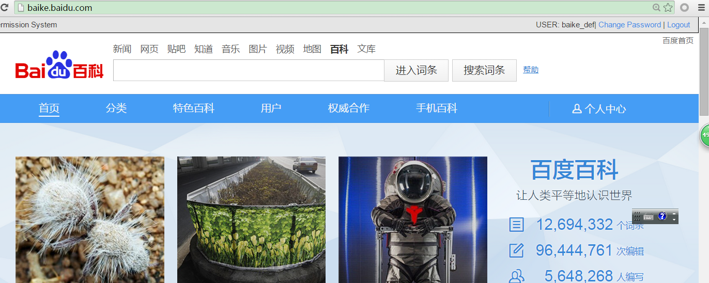<br/>
注意看，页面最上面出现一个横条，上面有显示当前用户，修改密码，登出等选项。

* 当访问的页面没权限时，会出现类似下面的页面：
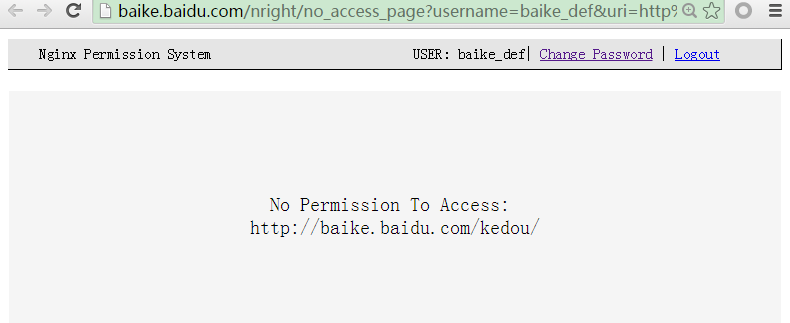<br/>

##### 测试用户
用户名 | 密码 | 权限 
----- | ---- | --- 
baike01 | 123456 | 仅访问首页权限
baike02 | 123456 | 首页，艺术，科技，自然，文化，历史上的今天，蝌蚪团，百科任务
baike03 | 123456 | baike01,baike02所有权限，加上词条权限(以/item开头),及/view开头的页面权限。

* 测试方法，请把baike.baidu.com 域名指定到114.215.210.244。即在hosts中添加：

```shell
114.215.210.244 baike.baidu.com
```
* 然后访问baike.baidu.com，注意：测试用户不能修改密码。